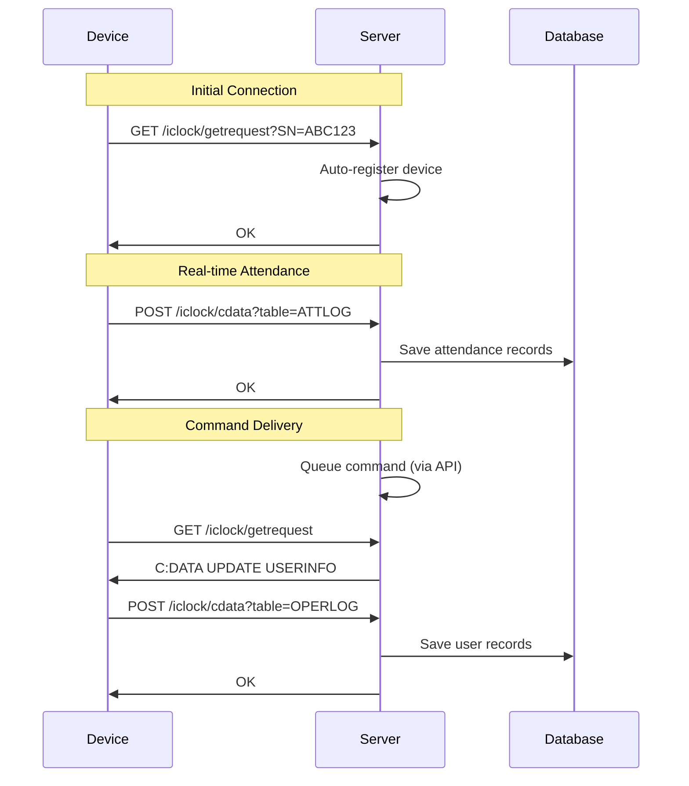

# 📘 ZKTeco Push Protocol Integration Guide

**Version:** 1.0
**Last Updated:** 2025-10-09
**Device Support:** SenseFace 4 Series and other PUSH-enabled devices

---

## 📋 Table of Contents

1. [Overview](#overview)
2. [Architecture](#architecture)
3. [Device Configuration](#device-configuration)
4. [API Endpoints](#api-endpoints)
5. [Data Flow](#data-flow)
6. [Testing](#testing)
7. [Troubleshooting](#troubleshooting)
8. [API Reference](#api-reference)

---

## 🎯 Overview

### What is Push Protocol?

Push Protocol is a communication method where **devices actively send data to the server**, as opposed to Pull Protocol where the server must connect to devices.

### Key Differences: Pull vs Push

| Feature | Pull Protocol (Traditional) | Push Protocol (Modern) |
|---------|---------------------------|----------------------|
| Connection | Server → Device (TCP) | Device → Server (HTTP) |
| Device Types | Older ZKTeco models | SenseFace 4 Series |
| Network Config | Requires device IP/port | Only requires server URL |
| Firewall | May need port forwarding | Works through NAT |
| Real-time | Polling required | Automatic push |
| Setup Complexity | Manual IP configuration | Auto-discovery |

### Supported Devices

- ✅ **SenseFace 4 Series** (Primary target)
- ✅ Any ZKTeco device with PUSH protocol support
- ❌ Older devices (use Pull Protocol instead)

---

## 🏗️ Architecture

### Components

```
┌─────────────────┐
│  Push Device    │
│ (SenseFace 4)   │
└────────┬────────┘
         │ HTTP POST/GET
         ▼
┌─────────────────────────────────────┐
│  Flask Application                  │
│                                     │
│  ┌───────────────────────────────┐ │
│  │ Push Protocol API             │ │
│  │ (push_devices.py)             │ │
│  └──────────┬────────────────────┘ │
│             │                       │
│  ┌──────────▼────────────────────┐ │
│  │ Push Protocol Service         │ │
│  │ (push_protocol_service.py)    │ │
│  └──────────┬────────────────────┘ │
│             │                       │
│  ┌──────────▼────────────────────┐ │
│  │ Database (SQLite)             │ │
│  │ - attendance_logs             │ │
│  │ - users                       │ │
│  │ - devices                     │ │
│  └───────────────────────────────┘ │
└─────────────────────────────────────┘
```

### File Structure

```
backend/src/app/
├── services/
│   └── push_protocol_service.py  # Core push protocol logic
├── api/
│   └── push_devices.py            # API endpoints for devices
└── __init__.py                     # Flask app (routes registered)

backend/biodata/                    # Biometric data storage
└── face_pin*.dat                   # Face templates
```

---

## 🔧 Device Configuration

### Step 1: Configure Device to Push Data

On your SenseFace 4 device:

1. **Navigate to:** Network Settings → Server Settings
2. **Set Server URL:** `http://YOUR_SERVER_IP:YOUR_PORT`
3. **Protocol:** Select "PUSH" or "HTTP"
4. **Push Interval:** 30 seconds (recommended)
5. **Save and Restart Device**

### Step 2: Verify Device Connectivity

The device will automatically:
- Ping the server every 30 seconds
- Auto-register on first connection
- Upload attendance data in real-time
- Upload user info when requested

### Server Configuration

**No manual device registration needed!** The system will:
- ✅ Auto-detect device on first ping
- ✅ Create device record in database
- ✅ Set device_type = 'push'
- ✅ Start receiving data immediately

---

## 🌐 API Endpoints

### Device-Facing Endpoints (Called by Device)

#### 1. Device Ping - Check for Commands
```
GET /iclock/getrequest?SN=ABC123&options=all
```

**Purpose:** Device pings periodically to check for pending commands

**Response:**
- `OK\r\n` - No commands
- `C:DATA UPDATE USERINFO\r\n` - Command to execute

---

#### 2. Device Handshake
```
GET /iclock/cdata?SN=ABC123
```

**Purpose:** Initial connection establishment

**Response:** `OK\r\n`

---

#### 3. Data Upload - Attendance Records
```
POST /iclock/cdata?SN=ABC123&table=ATTLOG&Stamp=9999
Content-Type: text/plain

1001\t2025-01-09 15:30:00\t0\t1
1002\t2025-01-09 15:31:00\t1\t15
```

**Data Format (TSV):**
- Column 1: User ID
- Column 2: Timestamp (YYYY-MM-DD HH:MM:SS)
- Column 3: Status (0=in, 1=out, 2=break-start, 3=break-end)
- Column 4: Verify Method (0=password, 1=fingerprint, 2=card, 15=face)

**Response:** `OK\r\n`

---

#### 4. Data Upload - User Information
```
POST /iclock/cdata?SN=ABC123&table=OPERLOG
Content-Type: text/plain

USER PIN=1001 Name=John Doe Grp=1 Pri=0 Verify=1 TZ=0
USER PIN=1002 Name=Jane Smith Grp=1 Pri=14 Verify=15 TZ=0
```

**Data Format (Key=Value):**
- PIN: User ID
- Name: User name
- Grp: Group ID
- Pri: Privilege (0=user, 14=admin)
- Verify: Verification methods enabled
- TZ: Timezone

**Response:** `OK\r\n`

---

#### 5. Data Upload - Biometric Templates
```
POST /iclock/cdata?SN=ABC123&table=BIODATA
Content-Type: text/plain

Pin=1001&Tmp=<base64_encoded_face_template>
```

**Response:** `OK\r\n`

**Side Effects:**
- Template saved to `backend/biodata/face_pin1001_ABC123.dat`

---

#### 6. File Upload - Raw Biometric Files
```
POST /iclock/fdata?SN=ABC123&PIN=1001
Content-Type: application/octet-stream

<binary data>
```

**Response:** `OK\r\n`

---

### Management API Endpoints (Called by Web UI)

#### 1. Queue Command for Device
```bash
POST /api/push/devices/ABC123/command
Content-Type: application/json

{
  "command": "DATA UPDATE USERINFO"
}
```

**Common Commands:**
- `DATA UPDATE USERINFO` - Request user list
- `DATA UPDATE FINGERTMP` - Request fingerprints
- `DATA QUERY ATTLOG` - Request attendance logs
- `CLEAR DATA` - Clear device memory

**Response:**
```json
{
  "success": true,
  "message": "Command queued successfully. Device will receive it on next ping.",
  "serial_number": "ABC123",
  "command": "DATA UPDATE USERINFO"
}
```

---

#### 2. Request User Upload
```bash
POST /api/push/devices/ABC123/upload-users
```

**Response:**
```json
{
  "success": true,
  "message": "User upload requested. Device will upload user list on next ping.",
  "serial_number": "ABC123"
}
```

---

#### 3. Request Attendance Upload
```bash
POST /api/push/devices/ABC123/upload-attendance
```

**Response:**
```json
{
  "success": true,
  "message": "Attendance upload requested. Device will upload logs on next ping.",
  "serial_number": "ABC123"
}
```

---

## 🔄 Data Flow

### Automatic Data Sync



### Auto-Registration Flow

1. **Device pings server** with serial number
2. **Server checks** if device exists in database
3. **If not exists:**
   - Create device record with `device_type='push'`
   - Set `auto_registered=true` in device_info
   - Set IP to `0.0.0.0` (not needed for push)
4. **Device is now active** and can send data

---

## 🧪 Testing

### Test 1: Device Auto-Registration

**Simulate device ping:**
```bash
curl -X GET "http://localhost:5000/iclock/getrequest?SN=TEST123&options=all&pushver=3.0"
```

**Expected Response:**
```
OK
```

**Verify in Database:**
```bash
# Check if device was created
sqlite3 zkteco_app.db "SELECT * FROM devices WHERE serial_number='TEST123';"
```

**Expected Result:**
- Device record exists
- `device_type = 'push'`
- `is_active = true`

---

### Test 2: Attendance Upload

**Simulate device sending attendance:**
```bash
curl -X POST "http://localhost:5000/iclock/cdata?SN=TEST123&table=ATTLOG&Stamp=1" \
  -H "Content-Type: text/plain" \
  -d "1001	2025-01-09 15:30:00	0	1
1002	2025-01-09 15:31:00	1	15"
```

**Expected Response:**
```
OK
```

**Verify in Database:**
```bash
sqlite3 zkteco_app.db "SELECT * FROM attendance_logs WHERE serial_number='TEST123';"
```

---

### Test 3: Queue Command

**Queue command via API:**
```bash
curl -X POST "http://localhost:5000/api/push/devices/TEST123/command" \
  -H "Content-Type: application/json" \
  -d '{"command": "DATA UPDATE USERINFO"}'
```

**Expected Response:**
```json
{
  "success": true,
  "message": "Command queued successfully. Device will receive it on next ping.",
  "serial_number": "TEST123",
  "command": "DATA UPDATE USERINFO"
}
```

**Device ping to receive command:**
```bash
curl -X GET "http://localhost:5000/iclock/getrequest?SN=TEST123"
```

**Expected Response:**
```
C:DATA UPDATE USERINFO
```

---

### Test 4: User Info Upload

**Simulate device sending user data:**
```bash
curl -X POST "http://localhost:5000/iclock/cdata?SN=TEST123&table=OPERLOG" \
  -H "Content-Type: text/plain" \
  -d "USER PIN=1001 Name=Test User Grp=1 Pri=0 Verify=1 TZ=0"
```

**Expected Response:**
```
OK
```

**Verify in Database:**
```bash
sqlite3 zkteco_app.db "SELECT * FROM users WHERE user_id='1001' AND serial_number='TEST123';"
```

---

## 🔍 Troubleshooting

### Issue 1: Device Not Auto-Registering

**Symptoms:**
- Device pings server but doesn't appear in database

**Solutions:**
1. Check server logs for errors:
   ```bash
   tail -f backend/logs/app.log | grep PUSH
   ```

2. Verify device serial number format:
   ```bash
   # Should see log like:
   [PUSH] Device ping: SN=ABC123, params={...}
   ```

3. Check database for device:
   ```bash
   sqlite3 zkteco_app.db "SELECT * FROM devices WHERE serial_number='ABC123';"
   ```

---

### Issue 2: Attendance Not Saving

**Symptoms:**
- Device sends ATTLOG but no records in database

**Solutions:**
1. Check attendance log format:
   - Must be TSV (tab-separated values)
   - Must have 4 columns minimum
   - Timestamp format: `YYYY-MM-DD HH:MM:SS`

2. Check for duplicate records:
   ```bash
   # Database has unique constraint on (user_id, device_id, timestamp, method, action)
   # Duplicates are silently skipped
   ```

3. Check server logs:
   ```bash
   tail -f backend/logs/app.log | grep ATTLOG
   ```

---

### Issue 3: Commands Not Delivered

**Symptoms:**
- Command queued but device doesn't receive it

**Solutions:**
1. Verify device is pinging regularly:
   ```bash
   tail -f backend/logs/app.log | grep "Device ping"
   ```

2. Check command queue:
   ```python
   # In Python console
   from app.services.push_protocol_service import push_protocol_service
   print(push_protocol_service._command_queues)
   ```

3. Verify serial number matches:
   ```bash
   # Serial number in API must match device's SN parameter
   ```

---

### Issue 4: Biometric Templates Not Saving

**Symptoms:**
- Device sends BIODATA but files not created

**Solutions:**
1. Check biodata directory exists and is writable:
   ```bash
   ls -la backend/biodata/
   ```

2. Verify base64 encoding:
   ```bash
   # Template must be valid base64
   # Check server logs for decode errors
   ```

3. Check file permissions:
   ```bash
   chmod 755 backend/biodata/
   ```

---

## 📚 API Reference

### Data Models

#### AttendanceRecord
```python
{
    'user_id': str,        # Employee ID
    'timestamp': str,      # YYYY-MM-DD HH:MM:SS
    'status': int,         # 0-5
    'verify_method': int   # 0,1,2,15
}
```

#### UserInfo
```python
{
    'user_id': str,       # PIN
    'name': str,          # Full name
    'group': str,         # Group ID
    'privilege': str,     # 0=user, 14=admin
    'verify': str,        # Verification methods
    'timezone': str,      # TZ
    'has_face': bool      # Face template exists
}
```

#### DeviceCommand
```python
{
    'command': str,           # Command text
    'created_at': datetime,   # When queued
    'device_sn': str          # Target device
}
```

---

### Status Codes

#### Attendance Status
- `0` = Check-in
- `1` = Check-out
- `2` = Break start
- `3` = Break end
- `4` = Overtime start
- `5` = Overtime end

#### Verify Method
- `0` = Password
- `1` = Fingerprint
- `2` = Card
- `15` = Face recognition

#### Privilege Level
- `0` = Normal user
- `14` = Administrator

---

## 🎓 Best Practices

### 1. Error Handling

Always return `OK\r\n` to device endpoints to prevent retry loops:

```python
try:
    # Process data
    process_attendance(data)
except Exception as e:
    logger.error(f"Error: {e}")
    # Still return OK to prevent device errors
    return "OK\r\n"
```

### 2. Thread Safety

Command queue is thread-safe using locks:

```python
with self._queue_lock:
    # Safe to modify command queue
    queue.append(command)
```

### 3. Logging

Use structured logging for debugging:

```python
logger.info(
    f"[PUSH] Attendance: user={user_id}, time={timestamp}, "
    f"status={status}, verify={method}"
)
```

### 4. Database

Handle duplicates gracefully:

```python
try:
    attendance_repo.create(log)
except UniqueConstraintError:
    logger.debug("Duplicate record skipped")
```

---

## 📞 Support

For issues or questions:

1. Check server logs: `backend/logs/app.log`
2. Review this documentation
3. Check device manual for PUSH protocol details
4. Contact ZKTeco support for device-specific issues

---

**Last Updated:** 2025-10-09
**Version:** 1.0
